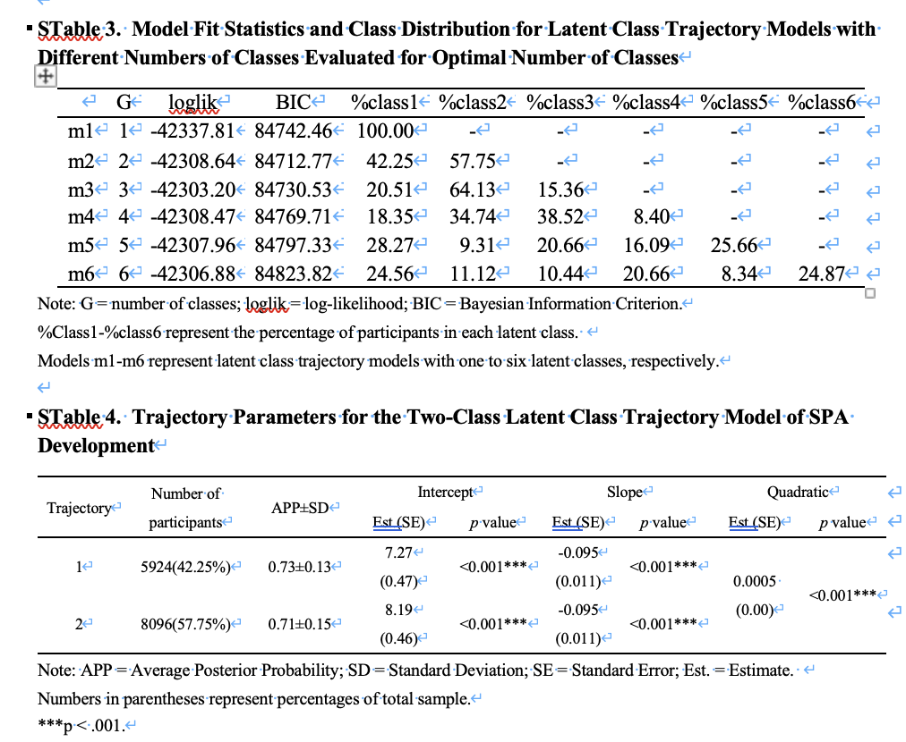

# Latent_class

潜在类别分析（Latent Class Analysis, LCA）是统计学中非常重要的一类方法，属于**潜变量模型（Latent Variable Models）**的范畴。它的核心在于通过观察到的数据推测潜在的、不可观测的类别结构。这个领域的研究自20世纪中期开始，至今已经发展成多种形式，广泛应用于社会科学、医学、心理学、教育等领域。

潜在类别分析作为一种强大的统计工具，已经成为了现代统计学和数据科学中不可或缺的一部分。它不仅适用于静态的类别划分，也可以扩展到考虑时间、轨迹和个体差异的复杂建模中。

随着数据类型的多样化、模型的复杂化和计算技术的发展，潜在类别分析的应用前景非常广阔。在未来，随着**贝叶斯方法**、**深度学习**等新技术的引入，潜在类别分析方法的表达力和灵活性将进一步增强，能够应对更加复杂和多样化的现实问题。

潜在类别分析不仅是一个建模工具，它背后隐含的**个体差异、群体模式和行为轨迹的研究**，将有助于我们更好地理解社会现象、个体行为及其背后的潜在机制。

---
## 我用过的潜在类别分析

我接触到潜在类别分析是我在上黄荣贵老师的社会统计课程的时候了解到的，然后后面做我的博士论文研究的时候发现在“self-perception of aging对健康的影响”这一研究领域，使用的自变量大多是基期测量的，由此引发了我的思考：self-perception of aging是不会变化的吗？我认为直接基于基期测量将人群分类有点过于潦草，而恰好我使用的调查数据是一个跨越十年的纵向追踪调查数据，于是想使用潜在类别增长模型（Latent Class Trajectory Models, LCTM）来进行分析。

按照标准的分析步骤拟合了1-6类，对比模型信息发现最优的为2类轨迹：

这两类群体的self-perception of aging随年龄的变化轨迹是这样的：

### 一、起源与发展历程

#### 1. **早期起源：心理学与社会学的需求**

潜在类别分析的起源可以追溯到20世纪初。心理学、社会学和教育学等领域的研究人员在研究人群的异质性时，发现传统的线性模型无法有效揭示人群中存在的潜在类别或群体特征。

1. **20世纪50-60年代：潜变量的初步构建**

潜在类别分析的早期思想受到了心理学和社会学领域对于“人群异质性”探索的影响。20世纪50年代，心理学家与社会学家开始意识到，个体的行为和态度可能来源于一些未观测到的潜在结构，而这种潜在结构能够解释个体之间的差异。

2. **Rasch模型和混合模型的前身**

在此基础上，心理学家 **Georg Rasch** 在1950年代提出了**Rasch模型**，该模型是潜在变量建模的先驱之一。Rasch模型认为，每个个体的表现可以由一个潜在的、未被观察的变量所决定，即“潜在特质”或“潜在类别”。

在社会学中，早期的潜变量模型，如**潜在变量模型**（Latent Variable Models）和**因子分析**，尽管有其理论和方法上的限制，但为后来的潜在类别分析铺平了道路。

---

#### 2. **LCA的形成与早期发展：**

20世纪60年代，**Ralph L. Brown** 和 **Paul Lazarsfeld** 等学者进一步推动了这一思路的正式发展，LCA开始从传统的因子分析中独立出来。

* **Lazarsfeld 和 Henry（1968）** 是最早提出潜在类别分析思想的学者之一。他们认为，调查数据中的异质性（如行为、态度等）无法通过单一的连续变量来解释，而应通过引入潜在的类别结构来进行建模。

* 他们将潜在类别分析视为一种“类别划分”的方法，试图将人群划分为多个潜在类别，这些类别可能在不同的观察维度上表现出不同的模式。

---

#### 3. **数学化与统计化：模型的逐步发展（1970-1990）**

随着计算能力的提升和统计方法的完善，潜在类别分析逐步变得更为系统化和数学化。

1. **1970年代：引入最大似然估计（MLE）**

* 1970年代，**Goodman** 在1974年发展了潜在类别模型的数学框架，并采用了**最大似然估计**（Maximum Likelihood Estimation, MLE）来估计潜在类别的参数。这一方法为后来的统计软件和模型的实现提供了基础。

2. **1980-1990年代：引入EM算法**

* **Expectation-Maximization (EM)算法**的提出，使得LCA的估计变得更加高效。EM算法使得能够在缺失数据或不完全数据的情况下进行潜在类别模型的估计，为LCA的应用提供了更加灵活和广泛的计算平台。

* **Nagin（1999）**的**群体轨迹建模**（Group-Based Trajectory Modeling, GBTM）方法是对LCA的扩展，旨在对时间序列数据进行潜在类别建模，并特别关注群体轨迹的分析。

3. **1990年代：多类混合模型和潜变量模型**

随着统计学方法和计算机技术的进步，潜在类别分析逐渐与**混合模型**（Mixture Models）和**有限混合模型**（Finite Mixture Models）结合起来，形成了更加灵活和精确的统计方法。

这一时期，学者们不仅关注如何估计潜在类别，还开始关注如何利用这些模型识别更复杂的类别结构，特别是**时间序列数据**的潜在类别分析逐步得到应用。

---

#### 4. **现代发展：模型的多样性和复杂性（2000至今）**

随着统计学和计算机科学的发展，潜在类别分析在方法和应用上经历了进一步的多样化和细化。

1. **多层次潜在类别分析**

* **多层次潜在类别分析（Multilevel Latent Class Analysis, MLCA）**在2000年代开始得到广泛应用，它引入了层次结构（如班级、学校等）来分析潜在类别之间的异质性。

2. **潜类别轨迹模型（Latent Class Trajectory Models, LCTM）**

* 潜类别轨迹模型（LCTM）融合了潜类别分析和轨迹建模（Growth Mixture Models, GMM），能够处理**时间序列数据**中的个体变化模式。这一方法已广泛应用于**健康行为**、**犯罪轨迹**、**社会变迁**等领域。

3. **Latent Class Growth Analysis (LCGA) 和 GMM（Growth Mixture Models）**

* 随着**轨迹建模**（Trajectory Modeling）的兴起，**Latent Class Growth Analysis**（LCGA）和**Growth Mixture Models**（GMM）逐渐成为了潜在类别分析领域的重要扩展，专注于**个体在多个时间点上的变化**，并将个体变化的异质性建模为潜在类别。

4. **贝叶斯方法和计算优化**

* 随着计算机技术的进步，**贝叶斯方法**（Bayesian Methods）在潜在类别分析中得到了广泛应用，提供了更多灵活性和模型不确定性分析的工具。

* 近年来，**深度学习**和**神经网络**等先进计算方法也开始与潜类别建模相结合，如**变分自动编码器**（VAE）和**生成对抗网络**（GAN）等模型开始进入潜在类别分析的视野。

---

### 二、潜在类别分析的理论与方法进展

#### 1. **理论基础：**

潜在类别分析的理论基础建立在**混合模型**和**条件独立性假设**之上。具体而言，LCA假设：

* **潜在类别变量**决定了观测数据的分布，而这些潜在类别是不可直接观测的。
* 给定类别变量的条件下，观测变量是独立的。

这种方法在建模复杂群体的异质性时非常有效，尤其是当数据的结构不适合传统的回归分析时。

#### 2. **方法发展：**

* **EM算法**：该算法通过期望和最大化步骤，使得在缺失数据和潜在类别分析中能够有效估计模型参数。
* **最大似然估计（MLE）**：潜在类别分析的参数估计基于最大似然原理，进一步增强了模型的统计可靠性。

---
### 三、潜在类别分析模型的家族图谱以及工具箱（R/STATA）

 **LPA**, **LTA**, **LCMM**, **LMM**, **LCTM**, **GMM**, **GBTM**, **LCGA** 等等都是这一类模型的重要成员，每个模型都对应不同类型的数据结构、时间维度、个体异质性处理方式等。

**模型关系图谱（简化）**

          +-----------+
          |   LCA     | ← 分类变量，不考虑时间
          +-----------+
                ↓
          +-----------+
          |   LPA     | ← 连续变量，不考虑时间
          +-----------+
                ↓
        +--------------------+
        |   LTA / LCMM       | ← 多期、多变量变化，加入转移建模
        +--------------------+
                ↓
+---------------------------------------+
|         LCTM / LCGA / GMM / GBTM      | ← 加入时间、轨迹、混合成分
+---------------------------------------+

> 📌 可以认为：**LCA** 是静态分类起点，**LCTM 家族**是引入了**时间维度和个体轨迹变化**的扩展。
---

#### 1. **总体脉络：从 LCA 到混合增长模型家族：**

| 方法             | 英文全称                          | 核心变量类型      | 是否建模时间 | 是否个体内变化 | 说明                        |
| -------------- | ----------------------------- | ----------- | ------ | ------- | ------------------------- |
| **LCA**        | Latent Class Analysis         | 分类          | ❌      | ❌       | 分类变量之间的潜在类别               |
| **LPA**        | Latent Profile Analysis       | 连续          | ❌      | ❌       | 连续变量的潜在类别划分               |
| **LTA**        | Latent Transition Analysis    | 分类（多期）      | ✅      | ✅       | 潜在类别随时间转移                 |
| **LCGA**       | Latent Class Growth Analysis  | 连续 + 时间     | ✅      | ✅       | 不同类有不同的轨迹，但类内无随机斜率（个体间差异） |
| **GMM / LGMM** | (Latent) Growth Mixture Model | 连续 + 时间     | ✅      | ✅       | 类别间轨迹不同，类内个体也不同（有随机效应）    |
| **GBTM**       | Group-Based Trajectory Model  | 连续/计数 + 时间  | ✅      | ✅       | 类别间轨迹不同，但类内完全一致（无随机效应）    |
| **LCTM**       | Latent Class Trajectory Model | 连续 + 时间     | ✅      | ✅       | 泛称，可包括 LCGA / GMM / GBTM  |
| **LCMM**       | Latent Class Mixed Models     | 连续 + 时间/协变量 | ✅      | ✅       | 可支持非线性时间、联立模型、事件史等        |

---

#### 2. **在 R 中的实现包一览**

| 模型                            | R 包                  | 说明                 |
| ----------------------------- | -------------------- | ------------------ |
| **LCA**                       | `poLCA`, `randomLCA` | 仅适用于分类变量           |
| **LPA**                       | `tidyLPA`, `mclust`  | 对连续变量进行分类          |
| **LTA**                       | `lmest`, `depmixS4`  | 用于潜类别随时间转移的建模      |
| **LCGA** / **GMM** / **LCTM** | `lcmm`（核心包）          | 灵活实现 LCGA/GMM/LCTM |
| **GBTM**                      | `traj`（较老）           | 主要用于犯罪、行为轨迹        |
| **LCMM**                      | `lcmm`               | 支持连续、时间、协变量、联合建模等  |
| **LMM**                       | `nlme`, `lme4`       | 非潜类别模型（无类）基准       |

---

#### 3. **Stata 中的支持情况**

Stata 对于 **LCA / LTA / LCTM / GMM** 的支持相对不如 R 灵活，但也在不断增强：

| 模型             | Stata 支持情况   | 命令                       |
| -------------- | ------------ | ------------------------ |
| **LCA**        | ✅            | `gsem`, `lclass`         |
| **LTA**        | ⚠️ 有限支持      | 自定义 `gsem`，较复杂           |
| **LCGA**       | ✅（通过 GMM 设定） | `traj`（用户写的）、`gsem` 复杂建模 |
| **GMM / LGMM** | ✅            | `gsem` + 随机斜率建模          |
| **GBTM**       | ✅            | 用户命令 `traj`（Nagin 方法）    |
| **LMM**        | ✅            | `mixed`（非潜类别）            |

----

🧩 但需要注意，**R 中的 `lcmm` 包** （[学习地址](https://cecileproust-lima.github.io/lcmm/)）是这类分析最全面、最灵活的实现之一，支持：

* 多轨迹模型
* 随机斜率
* 多结局联合建模
* 生存+轨迹联合模型
* 分类变量+连续变量混合建模

---

